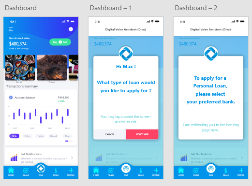
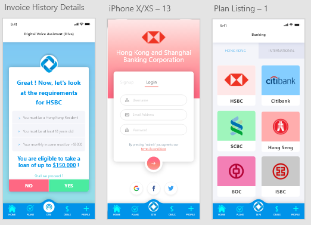

# Loan-App-UX
Made a protype User Experience design using Adobe XD for a proposed mobile app as a part of a Hackathon. The proposed idea was to design a digital, voice assistant app that will assist in managing the personal finances of a customer (user).

